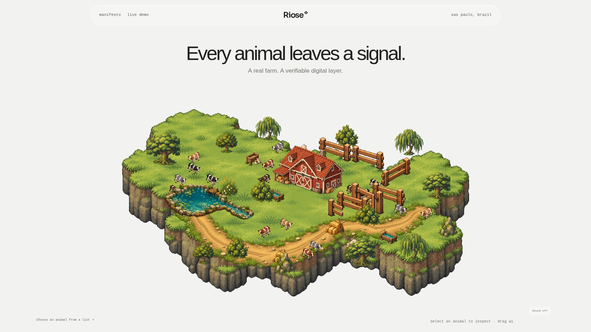

# RIOSE

### Every animal leaves a signal.

RIOSE connects an animal's ear-tag identity to a dependable record of its journey across the farm. When a record needs to be shared, a cryptographic digest can provide a verifiable reference without publishing the animal's private history.

[Explore the product demo](#run-the-demo) · [How it works](#from-animal-to-verifiable-record) · [Research inspiration](#research-inspiration)

<p align="center">
  
</p>
<p align="center"><sub>Ear-tag concept · RIOSE product direction</sub></p>

## One system, two farm environments

From a lush pasture to Brazil's open Cerrado, the demo applies the same RIOSE workflow to two different herd environments.

<p align="center">
  
</p>
<p align="center"><sub>Connected-farms concept · an art direction reference, not a live dashboard capture</sub></p>

The browser demo lets you explore the farm scenes, select individual animals, and inspect their profiles. The scene is an interactive product demonstration; its animal movement and location are not a live feed from deployed tags.

<p align="center">
  
</p>
<p align="center"><sub>Interactive farm demo</sub></p>

The homepage image below is an early presentation concept for the product experience.

<p align="center">
  
</p>

## From animal to verifiable record

1. **Identify** — connect an animal profile to its ear-tag identity.
2. **Record** — keep an ordered event history in RIOSE's local application.
3. **Create a digest** — derive a canonical SHA-256 commitment from the record.
4. **Anchor when needed** — the Solana Memo path can publish the digest; the full event and private farm data remain off-chain.

A confirmed on-chain commitment provides a shared reference for comparing a known record with its digest. It does not establish that an event happened, prove physical animal identity, or transfer ownership.

## Why this direction

RIOSE is inspired by research moving livestock care toward animal-specific sensing. One reference is [*Machine learning-assisted self-powered ear tag for animal welfare*](https://www.nature.com/articles/s41467-026-73651-7), published in *Nature Communications* in 2026. That work explores self-powered biochemical sensing; RIOSE's current software focuses on animal identity, event records, and verifiable commitments.

## Run the demo

Requirements: Python 3.12+ and [uv](https://docs.astral.sh/uv/).

```sh
./scripts/bootstrap.sh
uv run --locked cattle-rf demo --host 127.0.0.1 --port 8000
```

Open <http://127.0.0.1:8000/demo> to explore the farm experience. The local service also exposes the livestock API and RF simulator at the root and `/simulator` routes.

## What is in the repository

- **Livestock application:** animal profiles, Event V1 history, SQLite persistence, and an offline-first publication outbox.
- **Farm experience:** two interactive, illustrative farm scenes with selectable animals and contextual profiles.
- **Ear-tag engineering:** firmware models, RF simulation, localization research, and digital-twin tooling.
- **Verification software:** canonical commitments, a Solana Memo adapter, and an EVM registry/test harness.

## Current project status

The software paths have local automated coverage. Public-chain publication and physical field validation have not been independently verified; the browser farm and RF outputs are simulations or models. See the [integrated beta evidence](docs/reports/INTEGRATED_BETA_COMPLETION_GATE.md), [multichain evidence](docs/reports/MULTICHAIN_MAIN_RECONCILIATION_DOD.md), and [reproducible validation guide](reproducibility/README.md) for scope and results.

For implementation details, start with [`src/riose/products/livestock_tracking/`](src/riose/products/livestock_tracking/) and [`src/riose/products/ear_tag/`](src/riose/products/ear_tag/).
