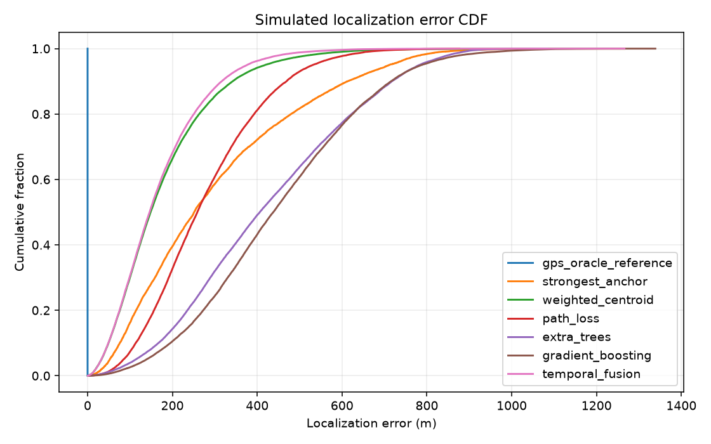

# RIOSE

**Livestock identity and provenance, built for offline-first operation.**

RIOSE is a research-stage livestock platform that connects animal and tag identity, sub-GHz positioning experiments, and local event records. An optional multichain publisher can anchor a privacy-preserving commitment for external verification; core records remain local and usable without a blockchain connection.

> **Current evidence:** `MULTICHAIN_SOFTWARE = COMPLETE` · `FIELD_VALIDATION = NOT_PERFORMED` · `FREQUENCIA = EXTERNAL`

## The product

Livestock activity and identity records need to remain useful when connectivity is unreliable, while still being traceable and shareable when needed. RIOSE explores that workflow with local animal records, RF simulation, ear-tag firmware and digital-twin models, and an append-only event history.

The software links an animal identity to local Event V1 records and their provenance. RF and tag outputs are simulations or modeled software evidence unless explicitly identified otherwise. RIOSE has not been validated on a farm.

## How it fits together

```mermaid
flowchart LR
  TAG[Animal and ear-tag models (simulated)] --> RF[Sub-GHz RF simulation]
  RF --> APP[Livestock application]
  APP --> DB[(Local SQLite records)]
  DB --> EVENT[Event V1 and local history]
  EVENT --> COMMIT[Canonical SHA-256 commitment]
  COMMIT --> PUB[Optional publication outbox]
  PUB --> SOL[Solana Memo]
  PUB --> EVM[Shared EVM registry]
  EVM --> BASE[Base]
  EVM --> ARB[Arbitrum]
```

The local event and its canonical commitment are chain-neutral. Each publication target has its own state and receipt; a chain outage does not prevent local event capture. The public envelope contains a commitment, not animal or event details.

### Animal and tag identity

RIOSE keeps animal identity and event history in the local product domain. The software models an ear-tag identity and its sensor/firmware behavior; it does not claim a physically validated tag or deployment. The Event V1 record is the local source of truth. Its deterministic commitment can be reused across publication targets without re-hashing for each chain.

### RF and offline-first infrastructure

The livestock product includes a CPU-first farm/RF simulator, positioning estimators, seeded datasets, and a local dashboard. The embedded workspace models firmware, radio and sensor interactions, and power behavior. Local SQLite records and the publication outbox support offline operation; publication is opt-in.

`FREQUENCIA = EXTERNAL`: FREQUENCIA is a separate research simulator integration, not a vendored RIOSE dependency. Research runs that use it require a separately configured checkout.

## Why Web3?

An external party may need to check that a published record matches a digest RIOSE created at a particular time. The blockchain path provides an optional public commitment and separate per-network receipts. It does **not** prove that an animal event is true, identify the animal from the digest, validate ownership, or replace the local record.

### Multichain status

`MULTICHAIN_SOFTWARE = COMPLETE`: the shared publication flow and chain-specific software paths are implemented and tested with local or mocked backends. Those tests are not public-chain validation.

| Network | Software path | Public-chain status |
| --- | --- | --- |
| Solana | Solana Memo adapter; mocked software tests | `SOLANA_REAL_ON_CHAIN = UNVERIFIED` |
| Base | Shared EVM adapter and registry; local Ganache tests use chain ID 84532 | `BASE_REAL_ON_CHAIN = UNVERIFIED` |
| Arbitrum | Same EVM adapter and registry; local Ganache tests use chain ID 421614 | `ARBITRUM_REAL_ON_CHAIN = UNVERIFIED` |

Local Ganache instances configured with Base or Arbitrum testnet chain IDs remain local simulations. No public transaction, contract deployment, or public receipt is claimed. See the [final multichain integration evidence](docs/reports/MULTICHAIN_FINAL_INTEGRATION_DOD.md) and the [Base](docs/reports/MULTICHAIN_MVP4A_BASE_DOD.md) and [Arbitrum](docs/reports/MULTICHAIN_MVP4_ARBITRUM_DOD.md) evidence reports.

### Commitments and verification

The canonical SHA-256 commitment is calculated from the public envelope and stays the same across chains. Event history and identifying details remain local. Software tests cover deterministic commitments, privacy boundaries, independent target state, retries, and local EVM execution. On-chain verification still requires a real transaction and independently checked receipt evidence.

## Digital twin and simulation

The ear-tag digital twin checks a provenance-controlled specification and orchestrates available engineering tools. MVP 3 adds Gazebo animal/tag scenarios and can bridge simulated sensor data into firmware models. These outputs are `ASSUMED` or `SIMULATED`, not physical measurements or field evidence. Review the [MVP 2 report](docs/mvp2-digital-twin-report.md) and [MVP 3 report](docs/mvp3-animal-digital-twin-report.md) for gates and limits.



## Run locally

Requirements: Python 3.12 or newer and [uv](https://docs.astral.sh/uv/).

```sh
./setup.sh
uv run cattle-rf demo --host 127.0.0.1 --port 8000
```

Open <http://127.0.0.1:8000>. The demo starts with a seeded farm and exposes local animal, anchor, telemetry, position, event, simulation, experiment, and metrics views. Position responses keep ground truth separate; debug truth fields require explicit opt-in.

To run tests and the benchmark:

```sh
uv run pytest -q
make benchmark
```

The C firmware-model suite can be run with `make hardware-test`. See
[architecture](docs/architecture.md) for product boundaries and the
[hardware report](hardware/reports/mvp-hardware-report.md) for model evidence
and engineering limits.

## Technical stack

- **Livestock product:** Python 3.12+, FastAPI, NumPy/SciPy, scikit-learn, and SQLite.
- **Tag engineering:** C firmware models, Zephyr `native_sim`, and Renode platform models.
- **Digital twin:** Gazebo Harmonic scenarios and provenance-aware specification checks.
- **Publication:** Solana Memo support, a shared EVM adapter, and a Solidity commitment registry exercised with local Ganache tests.

## Evidence and limitations

- `MULTICHAIN_SOFTWARE = COMPLETE`
- `SOLANA_REAL_ON_CHAIN = UNVERIFIED`
- `BASE_REAL_ON_CHAIN = UNVERIFIED`
- `ARBITRUM_REAL_ON_CHAIN = UNVERIFIED`
- `FIELD_VALIDATION = NOT_PERFORMED`
- `FREQUENCIA = EXTERNAL`

RF localization, hardware behavior, and digital-twin results are software simulations or models. Physical hardware, animal behavior, battery life, and field performance have not been validated. Local blockchain E2E tests do not establish public-chain transactions, confirmation, or finality. The current blockchain evidence and limitations are recorded in the [multichain integration report](docs/reports/MULTICHAIN_FINAL_INTEGRATION_DOD.md).

## Roadmap

1. Validate tag mechanics, radio, sensors, and power on physical hardware.
2. Run field studies and compare measured results with the simulation evidence.
3. Perform independently verifiable public testnet publications for Solana, Base, and Arbitrum.
4. Extend operational and finality evidence before making production claims.

## Team

Current GitHub contributors by commit history: [santleme](https://github.com/santleme) and [GUZZBR1](https://github.com/GUZZBR1). Roles and competition-team details are not specified in this repository.
