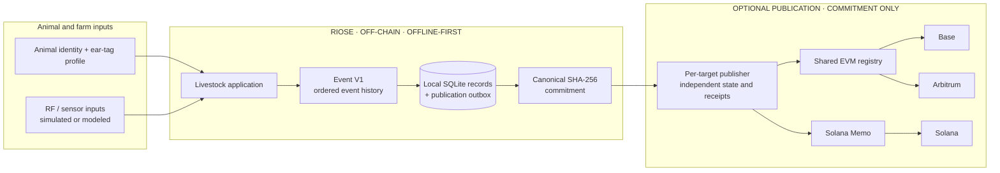

# RIOSE

**Offline-first livestock identity and event history, with optional verifiable commitments.**

RIOSE connects an animal and ear-tag identity to a local, ordered event history. When connectivity is available, it can publish a canonical commitment so a recipient can compare a known record with its digest—without putting the full event on-chain.

**Software status:** `MULTICHAIN_SOFTWARE = COMPLETE` · `FIELD_VALIDATION = NOT_PERFORMED` · `FREQUENCIA = EXTERNAL`

[Run the demo](#run-the-demo) · [Architecture](#how-riose-works) · [Evidence and limits](#evidence-and-validation-status)

## The problem and the product

Farm workflows need to keep recording when connectivity is weak. They also need a way to share or check a record later without turning a blockchain into the operational database.

RIOSE keeps animal records and Event V1 history local, then lets an operator publish a privacy-preserving commitment when a network is available. The current repository combines a seeded livestock/RF application with ear-tag firmware models, a digital-twin workflow, and optional Solana and EVM publication software.

## How RIOSE works

The animal/event workflow and complete operational record stay off-chain. Publication is opt-in: the same chain-neutral commitment can be sent to independent targets, while an outage on one target does not replace or erase the local event history. The public envelope carries the commitment and its format metadata, not animal details or the full event.

### Why Web3?

When a real publication exists, independent parties can check that the same digest was registered on a shared target. To compare the digest with a private event, the authorized holder must use local verification context; publication alone does not disclose or validate the event.

A commitment does **not** prove that an animal event is true, establish animal ownership, or validate a sensor reading. Public verification requires a real transaction and independently checked receipt; local and mocked tests do not establish that evidence.

### Multichain software support

RIOSE has one commitment and separate publication state for each target. These are implemented software paths, not claims of deployment to public networks.

| Target | Implemented software path | Current evidence |
| --- | --- | --- |
| Solana | Memo adapter | Software tests use mocked responses; `SOLANA_REAL_ON_CHAIN = UNVERIFIED` |
| Base | Shared EVM adapter and commitment registry | Local Ganache tests use chain ID 84532; `BASE_REAL_ON_CHAIN = UNVERIFIED` |
| Arbitrum | Same EVM adapter and registry | Local Ganache tests use chain ID 421614; `ARBITRUM_REAL_ON_CHAIN = UNVERIFIED` |

The local Ganache chain IDs identify test profiles; they are not public Base or Arbitrum transactions. See the [final Multichain report](docs/reports/MULTICHAIN_FINAL_INTEGRATION_DOD.md), [Base evidence](docs/reports/MULTICHAIN_MVP4A_BASE_DOD.md), and [Arbitrum evidence](docs/reports/MULTICHAIN_MVP4_ARBITRUM_DOD.md).

### What stays off-chain and on-chain

| Off-chain in RIOSE | Published commitment |
| --- | --- |
| Animal identity, complete Event V1 history, operational data, processing, local persistence, and queued work | Commitment digest plus the minimal format data needed by the target adapter |

The EVM registry accepts a `bytes32` commitment and exposes a registration event. Solana uses the Memo adapter. The full event and animal details are not replicated across these networks. Reusing one digest across targets makes those publications correlatable; it is not anonymity.

## Current capabilities

- **Animal identity and events:** local livestock records and a deterministic Event V1 chain.
- **Offline-first publication:** SQLite persistence and an opt-in outbox hold work locally until an operator attempts publication.
- **RF and tag engineering:** seeded farm/RF simulation, localization, C firmware models, and sensor/radio test harnesses.
- **Digital Twin:** provenance-controlled specifications and optional engineering-tool orchestration; outputs remain `ASSUMED` or `SIMULATED`.
- **Commitment verification:** deterministic SHA-256 commitment, privacy allowlist, and independent Solana/EVM target state.

## Run the demo

Requirements: Python 3.12 or newer and [uv](https://docs.astral.sh/uv/). The first install needs network access to fetch Python dependencies.

~~~sh
uv sync
uv run cattle-rf demo --host 127.0.0.1 --port 8000
~~~

Open <http://127.0.0.1:8000>. The demo starts with a seeded farm and provides local animal, anchor, telemetry, position, event, simulation, experiment, and metrics views. Position responses separate estimates from ground truth; debug truth fields require explicit opt-in.

To run the Python suite and host firmware-model tests:

~~~sh
uv sync --extra dev --extra solana --extra evm
npm ci --prefix contracts
uv run pytest -q
make hardware-test
~~~

The CMake/CTest harness is a host-side firmware/model test, not a physical-device test. Hardware, Renode, Gazebo, and local-EVM checks have their own optional tool requirements.

## Technical stack

- **Application:** Python 3.12+, FastAPI, SQLite, NumPy, SciPy, and scikit-learn.
- **Tag and RF engineering:** C host firmware models, Zephyr native_sim, Renode models, and seeded RF simulation.
- **Digital Twin:** Python orchestration with optional mechanical, antenna, power, and Gazebo tools.
- **Publication:** Solana Memo adapter, shared EVM adapter, Solidity registry, and local Ganache harness.

## Evidence and validation status

Latest repository verification: **884 passed, 7 skipped** in the Python suite; **39/39 passed** in the host CMake/CTest suite. Local EVM tests and Solidity compilation exercise local tooling only.

- `MULTICHAIN_SOFTWARE = COMPLETE`
- `SOLANA_REAL_ON_CHAIN = UNVERIFIED`
- `BASE_REAL_ON_CHAIN = UNVERIFIED`
- `ARBITRUM_REAL_ON_CHAIN = UNVERIFIED`
- `FIELD_VALIDATION = NOT_PERFORMED`
- `FREQUENCIA = EXTERNAL`
- `SIMULATED != VALIDATED`

RF localization, firmware behavior, power estimates, and Digital Twin outputs are software simulations or models unless a report explicitly says otherwise. No physical tag, animal, or farm validation has been performed. FREQUENCIA is an external simulator integration, not a vendored RIOSE dependency. Review the [integrated Beta gate](docs/reports/INTEGRATED_BETA_COMPLETION_GATE.md), [MVP 2 Digital Twin report](docs/mvp2-digital-twin-report.md), and [MVP 3 report](docs/mvp3-animal-digital-twin-report.md) for evidence and limitations.

## Roadmap

**Implemented:** local-first livestock workflow, Event V1, persisted commitments/outbox, software support for Solana/Base/Arbitrum, and simulation/model evidence.

**Next:** validate the tag and RF path on physical hardware; run field studies; and independently verify real public-chain publications and receipts for each target.

## Repository and team

- `src/riose/products/livestock_tracking/` — livestock application, event domain, persistence, and publication.
- `src/riose/products/ear_tag/` and `hardware/` — signal tools, Digital Twin, firmware, and engineering models.
- `contracts/` — local Solidity registry and EVM test harness.
- `tests/`, `docs/reports/`, and `results/` — regression tests and bounded evidence.

The current GitHub commit history lists contributors [santleme](https://github.com/santleme) and [GUZZBR1](https://github.com/GUZZBR1). The repository does not specify competition-team roles.
