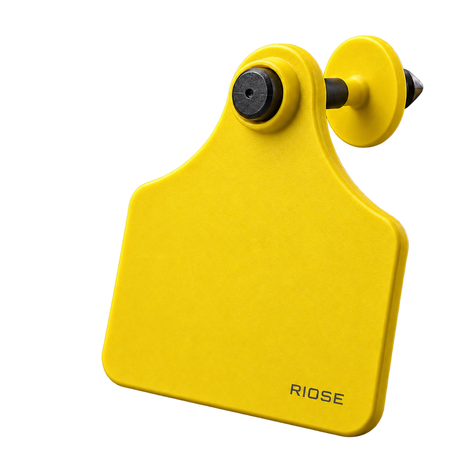
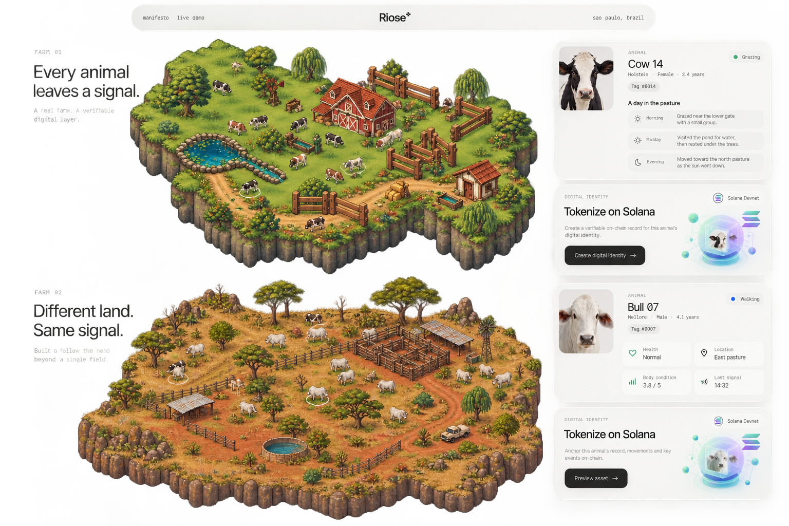
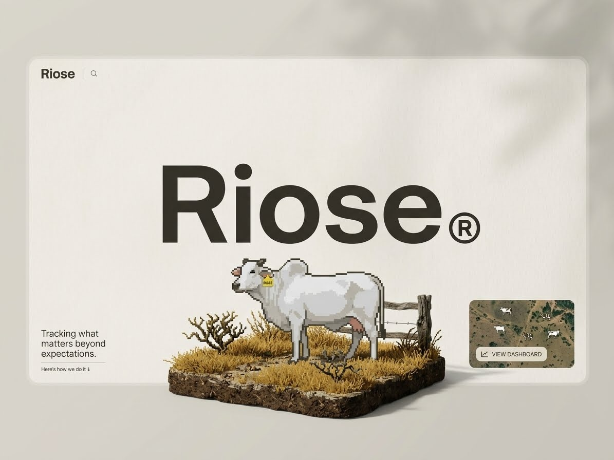

# RIOSE

### Every animal leaves a signal.

The product concept starts with an ear tag: a consistent identity for each animal. RIOSE connects that identity to an organized record of events across the farm—and gives each record a path to verifiable digital proof.



[Explore the product demo](#run-the-demo) · [Follow the story](#one-system-across-two-farms) · [Research inspiration](#research-inspiration)

<br clear="right">

## One system across two farms

Livestock environments are different. RIOSE is designed to follow the same individual-animal workflow from a lush pasture to Brazil's open Cerrado.

<p align="center">
  
</p>
<p align="center"><sub>Two farm environments, one product direction</sub></p>

## Follow an animal through its environment

The experience is organized around an individual animal, not a dashboard. In the [interactive demo](#run-the-demo), select an animal to bring its identity and record into focus while keeping the farm in view. Animal movement and location in the browser scene are part of the product demonstration, not a live feed from deployed tags.

<p align="center">
  
</p>
<p align="center"><sub>Early RIOSE homepage concept</sub></p>

## Turn a record into verifiable proof

An animal's story stays in the RIOSE application. When a record needs a shared proof, RIOSE can derive a cryptographic digest and anchor that digest on Solana.

1. **Identify** — associate an animal profile with its ear-tag identity.
2. **Record** — keep an ordered history of events in the local application.
3. **Create a digest** — derive a canonical SHA-256 commitment from the record.
4. **Anchor when needed** — publish the digest through the Solana Memo path; the event history and private farm data stay off-chain.

A confirmed commitment lets someone compare a known record with its digest. It does not establish that an event happened, prove physical animal identity, or transfer ownership.

## Research inspiration

RIOSE's direction is informed by research into animal-specific sensing. One reference is [*Machine learning-assisted self-powered ear tag for animal welfare*](https://www.nature.com/articles/s41467-026-73651-7), published in *Nature Communications* in 2026. That paper explores self-powered biochemical sensing; RIOSE's current software focuses on animal identity, event records, and verifiable commitments.

## Run the demo

Requirements: Python 3.12+ and [uv](https://docs.astral.sh/uv/).

```sh
./scripts/bootstrap.sh
uv run --locked cattle-rf demo --host 127.0.0.1 --port 8000
```

Open <http://127.0.0.1:8000/demo> to explore the farm experience. The local service also exposes the livestock API at the root and the RF simulator at `/simulator`.

## In the repository

- **Livestock application:** animal profiles, Event V1 history, SQLite persistence, and an offline-first publication outbox.
- **Farm experience:** two interactive, illustrative farm scenes with selectable animals and contextual profiles.
- **Ear-tag engineering:** firmware models, RF simulation, localization research, and digital-twin tooling.
- **Verification software:** canonical commitments, a Solana Memo adapter, and an EVM registry/test harness.

The software paths have local automated coverage. Public-chain publication and physical field validation have not been independently verified; the browser farm and RF outputs are simulations or models. See the [integrated beta evidence](docs/reports/INTEGRATED_BETA_COMPLETION_GATE.md), [multichain evidence](docs/reports/MULTICHAIN_MAIN_RECONCILIATION_DOD.md), and [reproducible validation guide](reproducibility/README.md) for scope and results.

For implementation details, start with [`src/riose/products/livestock_tracking/`](src/riose/products/livestock_tracking/) and [`src/riose/products/ear_tag/`](src/riose/products/ear_tag/).
