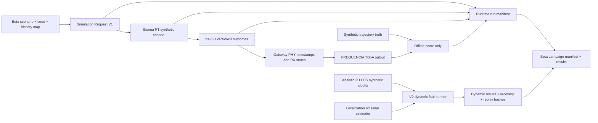
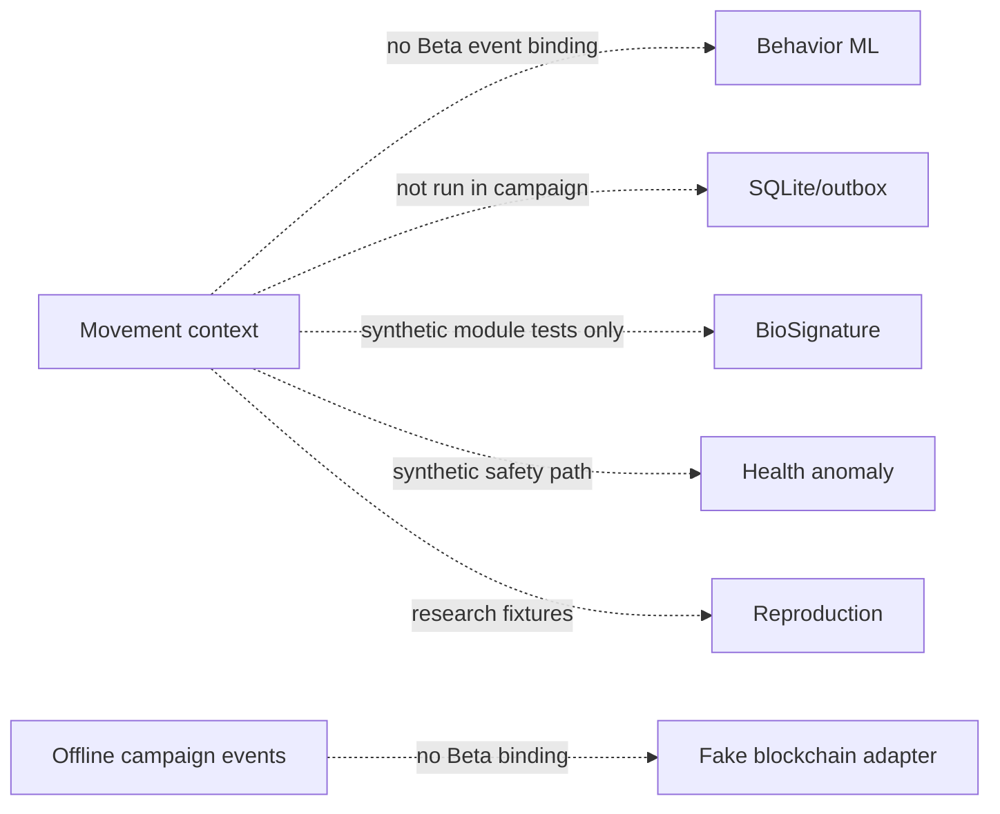

# Beta campaign dependency graph and mission state

## Executed evidence paths

Ground Truth is provided to the scenario generator and joined only after estimator output for scoring. It is not an estimator input. RF/LoRaWAN TDoA output and the separate analytic Localization V2 campaign are distinct evidence paths; their metrics are not pooled.

## Components not connected to the Beta RF run

These modules are audited and covered by the repository regression suite where tests exist, but this campaign does not claim an integrated RF-to-movement/health/reproduction/blockchain run.

## Dependency-aware mission status

| Front | State | Gate result | Why |
|---|---|---|---|
| Scenario/evidence contract and RF/LoRaWAN runner | DONE | PASS for declared simulated run contract | 13/13 final runs completed at one clean RIOSE SHA and pinned clean FREQUENCIA SHA |
| Tag Simulation Closure | DONE (audit) | PARTIAL | Firmware/simulator evidence exists; raw sensor-value propagation remains unverified; source worktree was dirty |
| RF Realism Campaign | DONE (audit + bounded campaign) | PARTIAL | Sionna paths characterized in declared synthetic scenes; calibration/field breadth absent |
| Network Scale & Capacity | DONE (audit + bounded campaign) | PARTIAL | Ten-tag low-cadence and two-tag collision cases; no larger capacity sweep or application delivery |
| Dynamic Localization & Fault Injection | DONE | PARTIAL | 28 x 10 x 24 analytic attempts and replay; no NLOS/physical clocks, wrong calibration false confidence remains |
| Movement Intelligence E2E | DEFERRED | EXPERIMENTAL | No Beta RF event binding; the external E2E worktree Git pointer could not be resolved |
| Blockchain + Hackathon Demo | DONE (audit) | PARTIAL | Offline fake adapter only; no Beta campaign chain publication |
| Repository Audit / current PR state | WAITING (external) | PARTIAL | GitHub API lookup was unavailable due DNS/connectivity; no branch merge or push was performed |

The two WAITING/DEFERRED items do not block production of independent simulation and report artifacts. They remain open gates in the final PARTIAL verdict.
